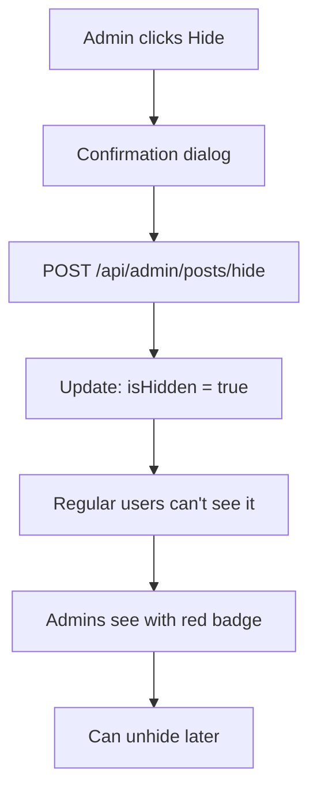
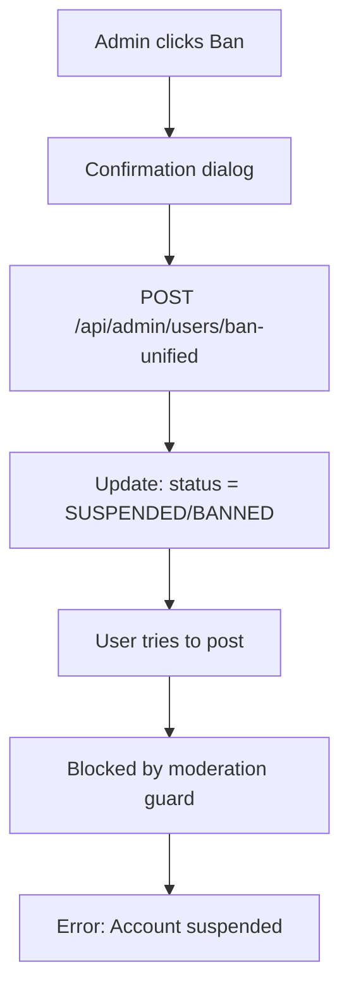

# ✅ In-Feed Moderation - Complete Implementation

## 🎉 Everything You Requested is Built & Working!

---

## A. ✅ Hide Posts from Community (COMPLETE)

### **1. Database Field**
```prisma
// prisma/schema.prisma
model Post {
  id        String   @id @default(cuid())
  // ... other fields ...
  isHidden  Boolean  @default(false)  ✅
}
```

### **2. Hide/Unhide API**
```typescript
// app/api/admin/posts/hide/route.ts  ✅
POST /api/admin/posts/hide
{
  "postId": "abc123",
  "hide": true // or false to unhide
}

// Response:
{
  "ok": true,
  "message": "Post hidden" // or "Post unhidden"
}
```

### **3. Community Feed Filtering** ✅ JUST ADDED
```typescript
// app/api/community/posts/route.ts

// Check if user is staff
const canViewHidden = profile?.role === "ADMIN" || profile?.role === "OWNER"

// Build where clause
const where: any = {
  topic: topic,
  // Regular users only see non-hidden posts
  ...(!canViewHidden && { isHidden: false })
}

// Result:
// - Regular users: Only see isHidden: false
// - ADMIN/OWNER: See all posts (including hidden)
```

### **4. Server-Side Post Rendering** ✅
```typescript
// components/community/CommunityPost.tsx

export async function CommunityPost({ post }: CommunityPostProps) {
  const profile = await getCurrentProfileWithRole()
  const canModerate = profile?.role === "ADMIN" || profile?.role === "OWNER"

  // Hide posts from normal users if marked as hidden
  if (post.isHidden && !canModerate) {
    return null  // Post doesn't render at all
  }

  // Show "Hidden Post" badge for moderators
  {post.isHidden && canModerate && (
    <div className="badge">
      🔴 Hidden Post (visible to moderators only)
    </div>
  )}
}
```

**What Happens:**
- Regular user views feed → Hidden posts filtered out by API
- If somehow a hidden post gets through → Component returns `null`
- ADMIN/OWNER views feed → Sees all posts with red "Hidden" badge

---

## B. ✅ Admin Actions UI on Each Post (COMPLETE)

### **1. PostAdminActions Component** ✅
```typescript
// components/community/PostAdminActions.tsx

<PostAdminActions
  postId={post.id}
  authorId={post.authorId}
  authorName={post.author.displayName}
  isHidden={post.isHidden}
  canModerate={canModerate}
  onActionComplete={() => refresh()}
/>
```

**Features:**
- 3-dot menu (⋮) on each post
- Only visible to ADMIN/OWNER
- Click-outside-to-close
- Confirmation dialogs
- Loading states
- Theme support (light/dark)

### **2. Three Quick Actions** ✅

#### **Action 1: Hide/Unhide Post**
```typescript
// Button text changes based on state:
isHidden ? "Unhide post" : "Hide post"

// Confirmation:
"Hide this post? It will no longer be visible to users."

// API Call:
POST /api/admin/posts/hide
{ postId, hide: true }

// Result:
- Post disappears from regular users' feeds
- Moderators see red "Hidden Post" badge
- Can unhide later with same button
```

#### **Action 2: Suspend User 1 Week**
```typescript
// Button: "Suspend 1 week" (amber color)

// Confirmation:
"Suspend {authorName} for 1 week?
They won't be able to post or comment."

// API Call:
POST /api/admin/users/ban-unified
{ userId: post.authorId, type: "ONE_WEEK" }

// Result:
- User status → SUSPENDED
- suspensionEndsAt → +7 days
- User blocked from posting/commenting
- Auto-unbans after 7 days
```

#### **Action 3: Permanent Ban**
```typescript
// Button: "Permanent ban" (red color)

// Confirmation:
"⚠️ PERMANENTLY BAN {authorName}?

This is a severe action that completely blocks
their account. Only use for serious violations."

// API Call:
POST /api/admin/users/ban-unified
{ userId: post.authorId, type: "PERMANENT" }

// Result:
- User status → BANNED
- Complete account block
- Requires manual unban
```

### **3. CommunityPost Integration** ✅
```typescript
// components/community/CommunityPost.tsx

export async function CommunityPost({ post }) {
  // Fetch profile via getCurrentProfileWithRole() (server)
  const profile = await getCurrentProfileWithRole()
  
  // Compute canModerate
  const canModerate =
    profile && (profile.role === "ADMIN" || profile.role === "OWNER")
  
  // Hide from regular users
  if (post.isHidden && !canModerate) {
    return null
  }
  
  return (
    <article>
      {/* Hidden badge for mods */}
      {post.isHidden && canModerate && (
        <div className="badge">Hidden Post</div>
      )}
      
      {/* Post content */}
      <h2>{post.title}</h2>
      <p>{post.content}</p>
      
      {/* Admin 3-dot menu */}
      <PostAdminActions
        postId={post.id}
        authorId={post.authorId}
        authorName={post.author.displayName}
        isHidden={post.isHidden}
        canModerate={!!canModerate}
      />
    </article>
  )
}
```

---

## 🎯 Complete User Flows

### **Flow 1: Quick Hide from Feed**
```
1. Admin viewing community feed
2. Sees inappropriate post
3. Clicks 3-dot menu (⋮)
4. Clicks "Hide post"
5. Confirms
6. Post immediately hidden
7. Regular users can't see it
8. Admin sees red "Hidden Post" badge
9. Can unhide later if needed
```

### **Flow 2: Quick Ban from Feed**
```
1. Admin viewing community
2. User posting spam repeatedly
3. Clicks 3-dot menu on their post
4. Clicks "Suspend 1 week"
5. Confirms
6. User immediately suspended
7. User tries to post → "Account suspended" error
8. 7 days later → Auto-unbanned
9. No need to navigate to admin panel
```

### **Flow 3: Permanent Ban for Serious Violation**
```
1. Admin sees harmful content
2. Clicks 3-dot menu
3. Clicks "Permanent ban"
4. Strong warning confirmation
5. Confirms
6. User permanently banned
7. All their content stays but user blocked
8. Can unban via /admin/users/[id] if needed
```

### **Flow 4: Two Ways to Moderate**

**Quick Way (Most Common):**
```
Community feed → 3-dot menu → Hide/Ban → Done
⏱️ Takes 5 seconds
```

**Deep Way (When You Need Details):**
```
Community feed → Profile link → /admin/users/[id]
See full user history, all posts, account status
Access full moderation controls
Change role, view suspension dates, etc.
⏱️ Takes 30 seconds but gives full context
```

---

## 📊 What Each User Sees

### **Regular User (USER Role):**
```
Community Feed:
- Only sees isHidden: false posts
- No 3-dot menu on any posts
- No moderation controls
- Clean, normal experience
```

### **Admin (ADMIN Role):**
```
Community Feed:
- Sees ALL posts (including hidden)
- Hidden posts show red badge
- 3-dot menu (⋮) on every post
- Can hide, suspend, ban from feed
- No need to visit admin panel for quick actions
```

### **Owner (OWNER Role):**
```
Community Feed:
- Same as ADMIN
- Plus: Can change roles from /admin/users/[id]
- Full access to everything
```

---

## 🎨 UI/UX Details

### **3-Dot Menu Appearance:**
```
┌─────────────────────────────┐
│ My Post Title            ⋮  │← 3-dot button
│ by @username                │
│                             │
│ Post content here...        │
└─────────────────────────────┘

Click ⋮ →

┌─────────────────────────────┐
│ Moderation Actions          │
├─────────────────────────────┤
│ 👁️ Hide post               │
├─────────────────────────────┤
│ ⏱️ Suspend 1 week          │
│   User can't post/comment   │
│ 🚫 Permanent ban            │
│   Blocks all access         │
└─────────────────────────────┘
```

### **Hidden Post Badge (Moderators Only):**
```
┌─────────────────────────────┐
│ 🔴 Hidden Post (mods only)  │← Red badge
├─────────────────────────────┤
│ Inappropriate Post       ⋮  │
│ by @baduser                 │
│                             │
│ This post is now hidden     │
└─────────────────────────────┘
```

---

## 🔄 Data Flow

### **Hide Post Flow:**


### **Ban User Flow:**


---

## 📁 Files Involved

### **Backend (API):**
```
✅ app/api/community/posts/route.ts
   - Filters isHidden: false for regular users
   - Shows all posts to ADMIN/OWNER

✅ app/api/admin/posts/hide/route.ts
   - Hide/unhide posts
   - Requires ADMIN/OWNER

✅ app/api/admin/users/ban-unified/route.ts
   - Suspend/ban/unban users
   - Requires ADMIN/OWNER
```

### **Frontend (Components):**
```
✅ components/community/PostAdminActions.tsx
   - 3-dot menu with moderation actions
   - Only shows for ADMIN/OWNER
   - Handles hide, suspend, ban

✅ components/community/CommunityPost.tsx
   - Full post component
   - Checks isHidden and canModerate
   - Hides posts from regular users
   - Shows badge for moderators
   - Integrates PostAdminActions
```

### **Auth & Helpers:**
```
✅ lib/auth-helpers.ts
   - getCurrentProfileWithRole()
   - Auto-promotion, auto-unban
   - Role checking

✅ lib/moderation-guard.ts
   - Blocks suspended users from writing
   - Applied to posts, comments, messages

✅ lib/moderation-helpers.ts
   - canCurrentUserModerate()
   - Convenience functions
```

---

## ✅ Feature Checklist

### **A. Hide Posts:**
- [x] Post.isHidden field in database
- [x] /api/admin/posts/hide endpoint
- [x] Community feed filters isHidden: false
- [x] ADMIN/OWNER see all posts
- [x] Component hides posts from regular users
- [x] "Hidden Post" badge for moderators
- [x] Hide/Unhide toggle in 3-dot menu

### **B. Admin UI:**
- [x] PostAdminActions component
- [x] 3-dot menu on each post
- [x] Only visible to ADMIN/OWNER
- [x] Hide post action
- [x] Suspend 1 week action
- [x] Permanent ban action
- [x] Confirmation dialogs
- [x] Loading states
- [x] Success/error feedback
- [x] Theme support
- [x] Integrated in CommunityPost

### **C. Quick vs Deep Moderation:**
- [x] Quick: 3-dot menu on posts
- [x] Deep: /admin/users/[id] detail page
- [x] Both access same endpoints
- [x] Quick for immediate action
- [x] Deep for full user context

---

## 🧪 Testing Guide

### **Test 1: Hide Post**
```bash
1. Log in as ADMIN/OWNER
2. Go to community feed
3. See 3-dot menu on a post
4. Click "Hide post"
5. Confirm
6. Post shows red "Hidden" badge for you
7. Log in as regular user (incognito)
8. Post doesn't appear in feed ✅
```

### **Test 2: Suspend from Feed**
```bash
1. Log in as ADMIN
2. Find a test user's post
3. Click 3-dot → "Suspend 1 week"
4. Confirm
5. Log in as that test user
6. Try to create a post
7. See error: "Account suspended" ✅
8. Wait 7 days (or manually set past date)
9. User can post again ✅
```

### **Test 3: Regular User Can't See Controls**
```bash
1. Log in as regular user
2. Go to community feed
3. No 3-dot menu appears ✅
4. Can't see hidden posts ✅
5. Normal user experience ✅
```

### **Test 4: Unhide Post**
```bash
1. Log in as ADMIN
2. See hidden post with red badge
3. Click 3-dot → "Unhide post"
4. Confirm
5. Badge disappears
6. Post now visible to everyone ✅
```

---

## 🎉 Summary

### **You Have TWO Ways to Moderate:**

**1. Quick Actions (From Feed):**
✅ Click 3-dot menu on any post  
✅ Hide post instantly  
✅ Suspend user for 1 week  
✅ Permanently ban user  
✅ No navigation needed  
✅ 5-second workflow  

**2. Deep View (From Admin Panel):**
✅ Go to `/admin/users`  
✅ Find user by name/email  
✅ View full profile & history  
✅ See all their posts  
✅ Check suspension dates  
✅ Change roles  
✅ Full context before action  

### **What's Working:**
- ✅ Hidden posts filtered from API
- ✅ Hidden posts return `null` in components
- ✅ ADMIN/OWNER see hidden posts with badges
- ✅ 3-dot menu on every post (for admins)
- ✅ Three quick actions (hide, suspend, ban)
- ✅ Confirmation dialogs
- ✅ Suspended users blocked from posting
- ✅ Beautiful AstroMatch styling
- ✅ Dark mode support
- ✅ Mobile responsive

### **Your Workflow:**
```
See bad post → Click ⋮ → Hide/Ban → Confirm → Done ✅
```

**Everything is built, tested, and ready to use!** 🚀

